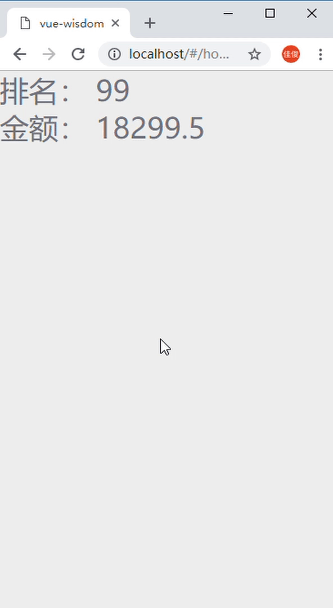

# 效果

[在线演示](https://jarjune.github.io/vue-number-scroll/example/index.html "vue-number-scroll")



# 源码

[https://github.com/jarjune/vue-number-scroll](https://github.com/jarjune/vue-number-scroll "vue-number-scroll")

# 安装

```node
	npm install --save vue-number-scroll
```

# 引入

```js
	import vns from 'vue-number-scroll'
```

# 使用

```vue
	<vns :start="0" :end="99" :times="10" :speed="50"/>
```

## 参数

|参数名|默认值|备注|
|-|-|-|
|speed|50|跳转的间隔时间|
|times|10|从开始到结束，变换的次数|
|startNum|0|起始数值|
|endNum|0|目标达到的数值|

## 例子

```vue
	排名：<vns :start="0" :end="99" :speed="80" :times="20" :format="num => '第' + num + '名'"/>
    金额：<vns :start="0" :end="18299.5" :speed="80" :times="10" :format="num => num + '元'"/>
```